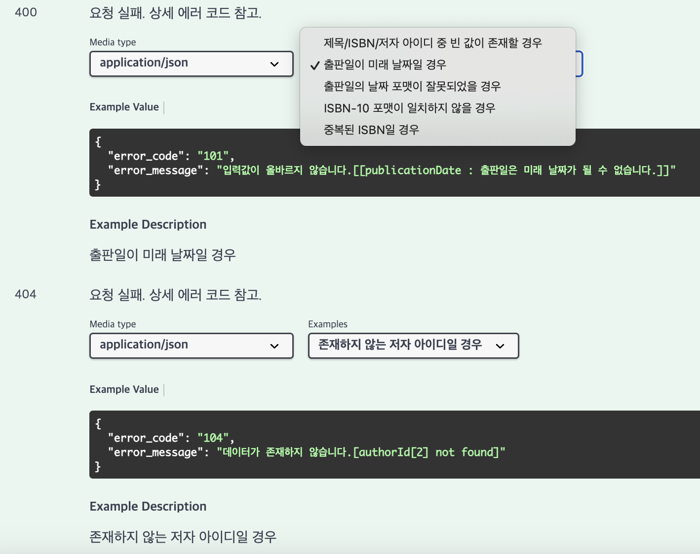
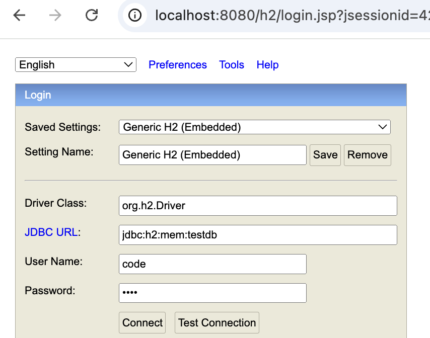
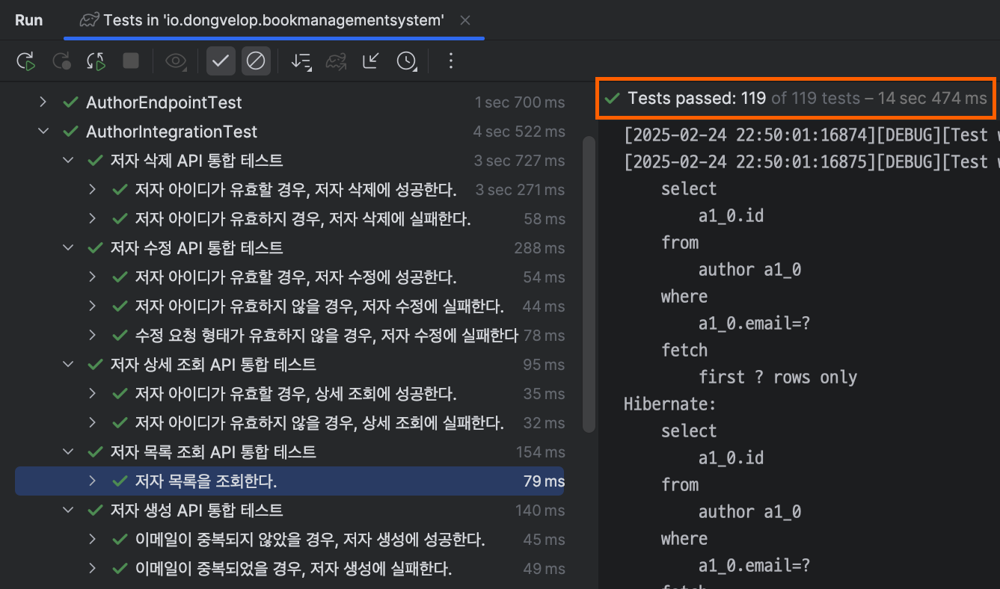

# book-management-system

코드 도서관리시스템 기술과제 소스코드입니다. [요구사항 명세 바로가기](docs/Requirement.md)


<br/>

### 목차

- [기술 스택 및 개발 환경](#기술-스택-및-개발-환경)
- [프로젝트 빌드 및 기동 방법](#프로젝트-빌드-및-기동-방법)
- [Swagger 접근 및 사용 방법](#swagger-접근-및-사용-방법)
- [H2 Database 접근 방법](#h2-database-접근-방법)
- [**예외 처리 및 메시지 국제화**](#예외-처리-및-메시지-국제화)
- [**테스트 코드 작성 규칙**](#테스트-코드-작성-규칙)
- [프로젝트 구조](#프로젝트-구조)

### 소개

- 테스트 코드 (Autoparams) 컨벤션. 문서 작성해야됨...

<br/>

### 기술 스택 및 개발 환경

- OpenJDK 17, Spring Boot 3.4.3, Gradle 8.12.1, H2 Database 2.3.232
- macOS Sequoia (Apple M1), CPU - Apple M1 (7-core), RAM - 16GB

<br/>

### 프로젝트 빌드 및 기동 방법

```shell
# 1. Git Clone
$ git clone https://github.com/2dongyeop/book-management-system.git

# 2. Project Build
$ cd book-management-system
$ ./gradlew clean build

# 3. Run JAR File
$ cd build/libs
$ java -jar book-management-system-1.0.0.jar
```

<br/>

### Swagger 접근 및 사용 방법

1. 프로젝트를 기동했다는 가정 하에 설명합니다.
2. 브라우저에서 "http://localhost:8080/swagger-ui/index.html" 접속합니다.
3. API 마다 요청/응답 형태 확인하실 수 있습니다.
4. 잘못된 요청의 경우, **에러 케이스를 세분화하여 확인**하실 수 있습니다.
   

<br/>

### H2 Database 접근 방법

1. 프로젝트를 기동했다는 가정 하에 설명합니다.
2. 브라우저에서 "http://localhost:8080/h2" 접속합니다.
2. 아래 정보 입력 후 `Connect` 버튼 클릭합니다.
    - Driver Class : org.h2.Driver
    - JDBC URL : jdbc:h2:mem:testdb
    - User Name : code
    - Password : code
      

<br/>

### 예외 처리 및 메시지 국제화

- 모든 예외 케이스에 대해서는 아래와 같은 포맷으로 응답합니다.
   ```json
   {
     "error_code": "101",
     "error_message": "입력값이 올바르지 않습니다.[${상세 메시지}]"
   }
   ```
- **메시지 국제화(다국어 처리) 적용**
    - 에러 메시지(`error_message`)의 경우, 설정한 로케일(`locale`)에 따라 변환됩니다.
    - 자세한 에러 메시지 국제화
      내용은 [resources/i18n](https://github.com/2dongyeop/book-management-system/tree/main/src/main/resources/i18n)에서 확인하실
      수 있습니다.

<br/>

### 테스트 코드 작성 규칙

- BDD 기반으로 테스트 흐름은 `given-when-then` 순으로 구성
    - Given 절에서 필요한 테스트 셋은 [Autoparams(오픈소스)](https://github.com/AutoParams/AutoParams)를 이용해 주입받는다.
- 단위 테스트 작성 대상
    - JPA Entity 내 비즈니스 로직, 유틸성 클래스
    - Controller 내 모든 API : `@WebMvcTest` 이용
    - Service 내 public 메서드 전부 : `@ExtendWith(MockitoExtension.class)` 이용
- 통합 테스트 작성 대상
    - Repository 내 직접 작성한 쿼리 전부 : `@DataJpaTest` 이용
    - Controller 내 모든 API : `@SpringBootTest` 이용
        - 이때, 매번 새로운 Spring 컨텍스트를 새로 로딩하지 않고 재사용하도록 하기
          위해 [Abstract Integration Test](https://github.com/2dongyeop/book-management-system/blob/main/src/test/java/io/dongvelop/bookmanagementsystem/endpoint/IntegrationTest.java)
          를 상속받아 작성한다.
- 모든 테스트는 성공/실패 케이스를 작성하며, 동일 분류를 `@Nested`를 이용해 그룹핑한다.
  

<br/>

### 프로젝트 구조

```shell
.
├── README.md
├── build.gradle
└── src
    └── main
        ├── java.io.dongvelop.bookmanagementsystem
        │   ├── common      # 상수 및 유틸성 클래스 위치
        │   ├── config      # 설정 클래스 위치
        │   ├── endpoint    # 컨트롤러 위치
        │   ├── entity      # JPA Entity 모델 위치
        │   ├── exception   # 예외 처리 관련 클래스 위치  
        │   ├── payload     # 요청/응답 클래스 위치
        │   ├── repository  # JPA Repository 위치
        │   └── service     # 서비스 위치
        │  
        └── resources
            ├── application.yml
            └── i18n                         # 메시지 국제화 정보
                ├── error.properties         # 에러 메시지 기본
                ├── error_en_US.properties   # 에러 메시지 영어 버전
                └── error_ko_KR.properties   # 에러 메시지 한국어 버전
```


